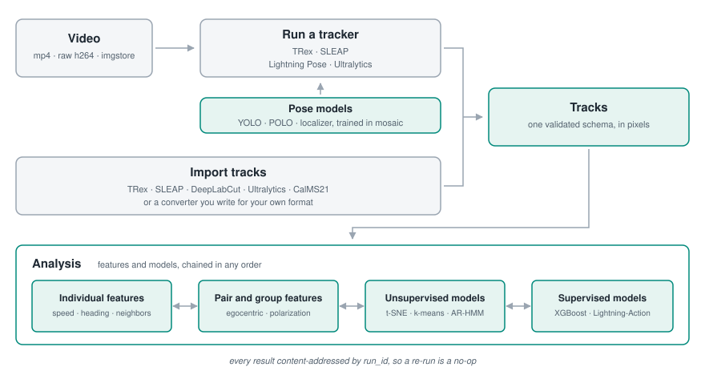

<p align="center">
  <picture>
    <source media="(prefers-color-scheme: dark)" srcset="docs/assets/pipeline-dark.svg">
    
  </picture>
</p>

<h1 align="center">mosaic</h1>
<p align="center"><strong>Behavior analysis for any animal, end to end.</strong></p>

<p align="center">
  <a href="https://github.com/EcodylicScience/mosaic/actions/workflows/ci.yml"></a>
  <a href="https://github.com/EcodylicScience/mosaic/actions/workflows/docs.yml"></a>
  
  
</p>

mosaic drives the pose trackers you already use — **TRex, SLEAP, DeepLabCut, Lightning
Pose, Ultralytics** — and turns their output into behavioral features, unsupervised
syllables, trained classifiers, and annotated video. One dataset, one CLI, one
standardized table underneath.

Every result is content-addressed: the same inputs and parameters produce the same
`run_id`, so re-running is a no-op, parameter sweeps organize themselves, and
`mosaic inventory` can tell you exactly what a dataset already holds.

**Documentation: <https://ecodylicscience.github.io/mosaic/>**

## What it does

| Step | What mosaic does |
| --- | --- |
| **Track** | Run **4 integrated trackers** over your videos from one command — or import tracks you already have, from **8 formats** |
| **Standardize** | Every tracker's output becomes one validated schema: video pixels, `X`/`Y` at the body centre, keypoints optional |
| **Feature** | **45 registered features** — kinematic, social, collective-motion, spectral, reduction, temporal context |
| **Model** | t-SNE, k-means, Ward, AR-HMM, keypoint-MoSeq; XGBoost / Lightning-Action / FERAL classifiers; three visual identity models |
| **Annotate** | Overlay video with identities, poses and predicted behavior; egocentric crops for identity work |
| **Train pose** | No tracks yet? Sample frames for annotation and train YOLO pose, POLO point detection, or a heatmap localizer from CVAT / COCO / Lightning Pose |
| **Operate** | **24 CLI commands** and **17 ops** behind one job contract, with a run log, cancellation, and a dataset inventory |

Built for group-living animals: identities, pairs and neighbors are first-class
throughout, not an afterthought bolted onto single-animal tracking.

## Install

`mosaic` is not on PyPI, so install it from a checkout:

```bash
git clone https://github.com/EcodylicScience/mosaic.git
cd mosaic
conda create -n mosaic python=3.12 -y
conda activate mosaic
conda install -c conda-forge ffmpeg av py-opencv -y
pip install -e ".[all]"
```

`pip install -e .` alone is a complete analysis install — converters, features,
clustering, classifiers, overlays. `[all]` adds the deep-learning surface (YOLO
pose, `mosaic track ultralytics`, the localizer, the identity models), which
means PyTorch. `av` and `py-opencv` come from conda deliberately: their PyPI
wheels each bundle a complete ffmpeg, and two in one process crash it. The
[installation guide](https://ecodylicscience.github.io/mosaic/installation/)
explains that, the full extras table, a CPU-only PyTorch line, the two components
that want an environment of their own, and Windows/WSL2 support.

## In 60 seconds

```bash
mosaic init study --name "Cage A"

# Point the dataset at video that can live anywhere -- a NAS, another volume.
mosaic sources add -m study/dataset.yaml --kind media \
    --path /data/cage-a --extensions .mp4
mosaic scan -m study/dataset.yaml

# Track it, then derive something from the result.
mosaic track trex -m study/dataset.yaml --set track_max_individuals=4
mosaic run  -m study/dataset.yaml --feature speed-angvel

# What does this dataset now hold, and is any of it stale?
mosaic inventory -m study/dataset.yaml
```

Already have tracks? Skip the tracker: declare them as a `--kind tracks` source with
their `--src-format`, and `mosaic convert-tracks` standardizes them.

## Documentation

| | |
| --- | --- |
| [**Get started**](https://ecodylicscience.github.io/mosaic/getting-started/) | Install, build a dataset, run your first feature |
| [**Reference**](https://ecodylicscience.github.io/mosaic/reference/) | Every feature, op, CLI command and track format — generated from the code |
| [**Extend**](https://ecodylicscience.github.io/mosaic/adding-a-converter/) | Add a track converter, a tracker, or a feature |

Worked examples live in [`notebooks/`](notebooks/): an end-to-end
[CalMS21 template](notebooks/calms21-template.ipynb), and collective motion on
[shiners](notebooks/collective-motion-shiners.ipynb) and
[zebrafish](notebooks/collective-motion-zebrafish.ipynb). They read data that is not
bundled with the repository, so treat them as illustrated results rather than as
runnable tutorials.

## Status

Early development (0.x). Public APIs, feature names, and on-disk layouts may change
between releases; [CHANGELOG.md](CHANGELOG.md) records what moved and why.

## Contributing

See [CONTRIBUTING.md](CONTRIBUTING.md), and please open an issue before making large
changes. Working with an AI coding agent? [CLAUDE.md](CLAUDE.md) is the repository
orientation.

## License

GNU Affero General Public License v3 or later. See [LICENSE](LICENSE), and
[NOTICE](NOTICE) for the third-party attributions that must travel with it.

mosaic bundles no third-party source and no model weights, but it drives tools whose
terms differ from its own — keypoint-MoSeq prohibits commercial use, TRex requires a
paid license for company use, and Ultralytics is AGPL-3.0.
[Licensing](https://ecodylicscience.github.io/mosaic/licensing/) states which
components carry restrictions and what mosaic does about each.
